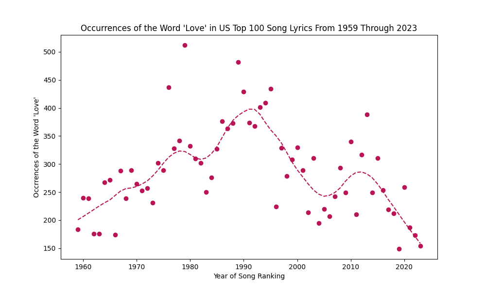
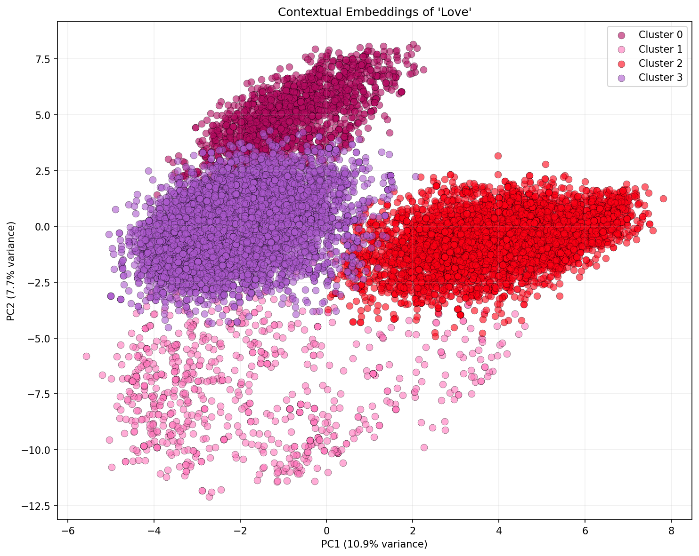
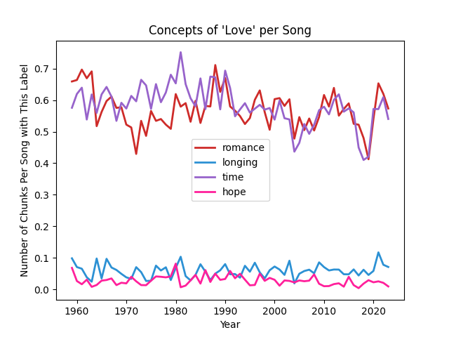

# NotesOfLove
Term project for IDS 570

*How do songwriters' concepts of love change across the 64-year period from 1959 and 2023?*

##Description
I examined the concept of love in lyrical content of approximately 6,400 songs across a 64-year period. I employed the following techniques and models: named entity recognition (NER), bidirectional encoder representations from transformers (BERT), and supervised classification. In keeping with past studies, my corpus is a compilation of Billboard Top 100 songs in the United States (US).

